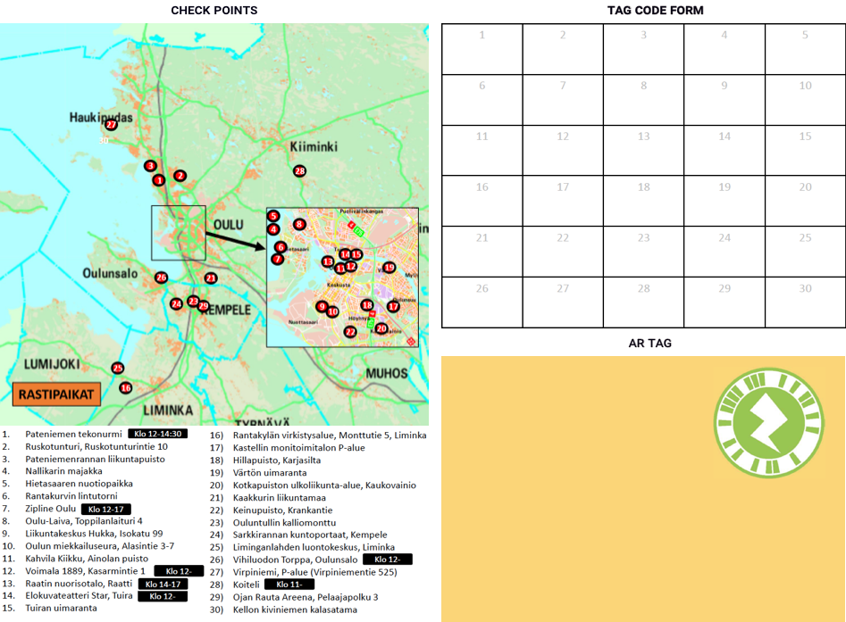
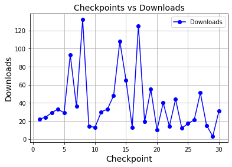

Title: Game-based Active Mobility with Augmented Reality 
Date: 2021-1-15 21:55
Tags: active mobility, games, urban environment, augmented reality
Slug: game-based-active-mobility
Author: Michael O
Series: Urban Lifestyle Engineering
Series_index: 2

 We conducted a study to explore how to encourage active mobility and tested people’s experience and perceptions of a web-based AR application used during an open sports day.

Most of the world population living in urban areas continues to grow [^1]. As the global population shifts to urban areas, there is an increased need for practical solutions to address the physical and mental wellbeing of citizens and to enhance the standard of living in urban environments. Among the problems in urban areas are premature mortality rates caused by physical inactivity and sedentary lifestyles, which lead to chronic diseases. According to World Health Organization (WHO) [^2], physical inactivity and sedentary behaviour could partly be attributed to the effects of urbanisation, which has led to detrimental factors such increase in traffic, low air quality and lack of recreational facilities.

We need innovative solutions to address many of the problems we face as society. There has been a steady growth in systems aimed at motivating people to attain their goals by guiding them towards more sustainable behaviours [^3]. Digital interventions have transformed the sustainability, healthcare and wellness sectors by enhancing user independence in improving their own wellbeing and overall health. Using technology in these different domains applying techniques such as gamification to start and maintain self-beneficial behaviour is nowadays commonplace[^4],[^5]. Digital technologies in different modalities are now part of our daily lives and increasingly “co-constitute” our experience of the urban environment [^6].

As part of the ULE project, we are interested in exploring the role of technology in encouraging active mobility in urban environments. A topic that has received increased attention in recent years. One aim of the project is to investigate how to integrate technology into existing urban environments to encourage physical activity, city exploration, and community awareness. Research shows how the characteristics of urban environments can contribute positively to health by influencing people’s physical activity levels. Related to this, we conducted a pilot study in the Autumn of 2020 to examine the role of augmented reality (AR) in encouraging active mobility by providing an enjoyable and interactive experience while exploring an urban environment.

We asked participants to download and print instructions for completing the tasks from the events website prior to their participation. And during the event, they were to share photos and videos of themselves doing the distinct challenges with the events’ hashtag and location on social media. We encouraged participants to either walk, cycle or use public transportation to get to the checkpoints that were at 30 different locations. The challenges required participants to navigate from point to point in Oulu, a Finnish city in northern Finland, and its environs using a specially prepared map, which they used to find the checkpoints. The checkpoints had posters with AR tags, which participants needed to scan (Figure 1).

 
  <figcaption><b>Figure 1.</b> Study design – checkpoints, tag code and AR tag form</figcaption>

Once scanned, they displayed a video and a code. The video showed the challenge, and each location had its own letter code, which they marked in the printed document after completing the challenge. The challenges required the use of facilities or the features available at each location, for example, doing mild-to-moderate exercises using outdoor stairs, walking/jogging to the top of a hill and taking a photo of the view, using outdoor gym equipment to exercise and so on. We reviewed log data and questionnaire responses after the event. The log data for the number of times participants accessed the application at each location. Three locations had over a hundred downloads, and there were visitors to all 30 locations (Figure 2).

 
  <figcaption><b>Figure 2.</b> Number of downloads at each checkpoint</figcaption>
</figure>

Overall, participations perceptions of the AR application and its usability were mostly positive. Some particularly enjoyed how the application revealed the challenges at each location. The pilot study provided a good example of how to integrate gameful experiences with the aid of technology into the physical environment. It served as a basis for future work where we plan to use motivation techniques such as gamification to encourage active mobility, social interaction, and sustainable use of urban resources.

[^1]: United Nations. (2018). 68% of the world population projected to live in urban areas by 2050. United Nations - Department of Economic and Social Affairs. https://www.un.org/development/desa/en/news/population/2018-revision-of-world-urbanization-prospects.html 
[^2]:  World Health Organization (WHO). (n.d.). Physical Inactivity: A Global Public Health Problem. https://www.who.int/teams/health-promotion/physical-activity
[^3]: Chatterjee, S., & Price, A. (2009). Healthy Living with Persuasive Technologies: Framework, Issues, and Challenges. Journal of the American Medical Informatics Association, 16(2), 171–178. 
[^4]: Morford, Z. H., Witts, B. N., Killingsworth, K. J., & Alavosius, M. P. (2014). Gamification: The Intersection between Behavior Analysis and Game Design Technologies. The Behavior Analyst, 37(1), 25–40.
[^5]: Hamari, J., & Koivisto, J. (2015). Why do people use gamification services? International Journal of Information Management, 35(4), 419–431. 
[^6]: Papangelis, K., Saker, M., & Jones, C. (2020). Smart Cities at Play: Technology and Emerging forms of playfulness. Behaviour & Information Technology, 39(6), 607–609. 