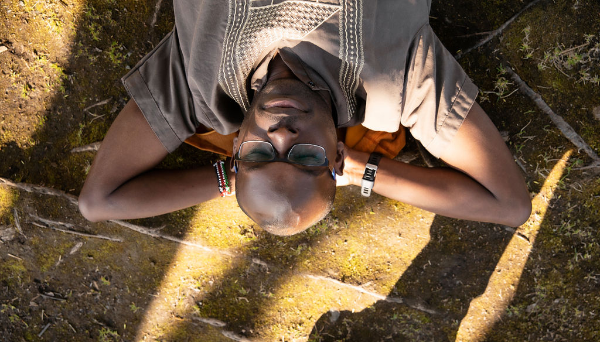

Title: About Me
Author: Michael Oduor
Menulabel: About

### My background

I am an "out-going introvert" from Kenya who's been living in Finland for over 10 years. I am relatively calm person with a dream to make the world a better place, but sometimes lacking the fortitude to continuously pursue the dream 🙂. I enjoy being of service to others and  never pass up an opportunity to help if I can. 

After years of contemplation (and starting and stopping one or two personal blogs), it was about time to have a place to share thoughts, learn, test ideas and along the way maybe educate one or two! 

I earned my <a href= "http://jultika.oulu.fi/Record/isbn978-952-62-1885-4" target="_blank">PHD</a>  in information processing science from the Faculty of Information Technology and Electrical Engineering, University of Oulu in the Spring of 2018. In July 2020, I started working on a project in collaboration with an Oulu-based [urban planning and design agency](https://navico.fi/etusivu/). An overview of the project [here](https://mattersearthly.co/projects.html).

My research has been about the design of persuasive systems, understanding human behaviour and how technology influences and can be used to change/shape human behaviour for the better. 

My research interests include:
	<ul>
  		<li>Persuasive systems (design) and Gamification </li>
  		<li>Use and adoption of digital services </li>
  		<li>Digital Health </li>
  		<li>Community-wide interventions for sustainable and active mobility</li>
  		<li>Social and Digital Inclusion</li>
  		<li>Understanding users' decision-making processes and psychological aspects of behaviour change</li>
	</ul> 
	 
Other interests:
<ul>
	<li>Data and content analysis</li>
	<li><a href= "https://suboulu.wordpress.com" target="_blank">Location-based social media analysis</a></li>
	<li><a href= "http://fabacademy.org/2019/labs/oulu/students/michael-oduor/" target="_blank">Principles and applications of digital fabrication</a></li>
</ul>

 
### Hobbies

Football has been part of my life for as long as I can remember. As with my dream of making the world a better place, I haven't had the fortitude to pursue football beyond the amateur level and my time is now long gone (if there ever was such a time 😌). In addition to football and following other sports like athletics, I enjoy playing scrabble and chess, listening to music (at times very loudly), reading (mostly psychological, design and business-related books, but I can pretty much read anything), writing (when the motivation strikes!), occasionally binge-watching tv programmes and generally meeting people.

I also enjoy participating in voluntary activities. I have been part of clubs and associations such as <a href= "https://en.m.wikipedia.org/wiki/Rotaract" target="_blank">Rotaract</a> in Kenya and <a href= "https://aiesec.org" target="_blank">AIESEC</a> at the university of Oulu which focus on teamwork, members' personal development and community service. In addition to volunteering for <a href= "https://plan.fi" target="_blank">Plan Finland</a>, <a href= "https://jshercules.com/etusivu/" target="_blank">Hercules Football Club</a> and other organisations throughout the years.

 <small>Photo by <a href= "https://kotacollective.com/harri-tarvainen" target="_blank">Harri Tarvainen</a></small> 

        

          <h3>Contact</h3> 
          <ul style="list-style-type:none;">
          	<li> <small>Michael Oduor </small> </li>
          	<li><small>Faculty of Information Technology and Electrical Engineering</small></li>
          	<li><small>University of Oulu</small></li>
          	<li><small>P.O.Box 3000, 90014</small> </li>
          	<li><small>Oulu, Finland</small></li>
          	<li><small>Email: firstname.lastname(at)oulu.fi</small></li>
          	<li></li>
          	<li></li>
          </ul>      
        

        

          <h3>Find me online</h3>
          <ul class="list-group social">
            <li class="list-group-item"><small><a href="https://twitter.com/oduorm"><i class="fa fa-twitter-square fa-lg"></i>Twitter</a></small></li>
            <li class="list-group-item"><small><a href="https://www.linkedin.com/in/michaeloduor/"><i class="fa fa-linkedin-square fa-lg"></i> LinkedIn</a></small></li>
            <li class="list-group-item"><small><a href="https://github.com/Modago"><i class="fa fa-github-square fa-lg"></i> GitHub</a></small></li>
          </ul> 
        

      

      

   
   
