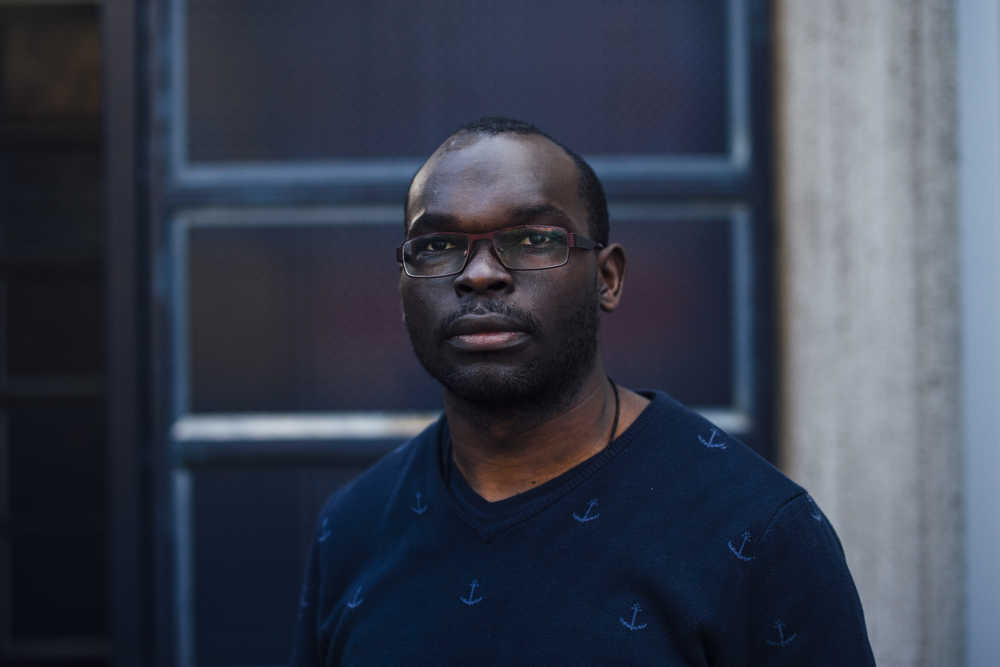

Title: About Me

<!-- -->

### My background

I am an "out-going introvert" from Kenya who's been living in Finland for 11 years. I am relatively calm person with a dream to make the world a better place, but sometimes lacking the fortitude to continuously pursue the dream 🙂. I enjoy being of service to others and  never pass up an opportunity to help if I can. All in all, I am a confused ... year old trying to find his place in the world a smile at a time. 

After years of contemplation (and starting and stopping one or two personal blogs), it was about time to have a place to share thoughts, learn, test ideas and along the way maybe educate one or two! 

I earned my <a href= "http://jultika.oulu.fi/Record/isbn978-952-62-1885-4" target="_blank">PHD</a>  in information processing science from the University of Oulu in the Spring of 2018. Currently, I work part-time as a post-doctoral researcher at the <a href= "https://www.oulu.fi/oasis/" target="_blank">OASIS research unit</a> in the Faculty of Information Technology and Electrical Engineering, University of Oulu. My research is about the design of persuasive systems, understanding human behaviour and how technology influences and can be used to change/shape human behaviour for the better. 

My research interests include:
	<ul>
  		<li>Persuasive systems (design) and behaviour change. </li>
  		<li>Use and adoption of digital services. </li>
  		<li>Understanding users' decision-making processes and psychological aspects of change.</li>
  		<li>Digital interventions for the marginalised in society.</li>
	</ul> 
	 
Other interests:
<ul>
	<li>Social Network Analysis.</li>
	<li><a href= "https://suboulu.wordpress.com" target="_blank">Location-based social media analysis</a></li>
	<li><a href= "http://fabacademy.org/2019/labs/oulu/students/michael-oduor/" target="_blank">Principles and applications of digital fabrication</a></li>
		<ul><li>All the files for the assignments are in <a href= "https://gitlab.fabcloud.org/academany/fabacademy/2019/labs/oulu/students/michael-oduor" target="_blank">Gitlab</a>.</li>
		</ul>
</ul>

 
### Hobbies

Football has been part of my life for as long as I can remember. As with my dream of making the world a better place, I haven't had the fortitude to pursue football beyond the amateur level and my time is now long gone (if there ever was such a time 😌). In addition to football and following other sports like athletics, I enjoy playing scrabble and at times chess, listening to music (at times very loudly), reading (mostly psychological, design and business-related books, but I can pretty much read anything), writing (when the motivation strikes!), occasionally binge-watching tv programmes and generally meeting people.

I also enjoy participating in voluntary activities. I have been part of clubs and associations such as <a href= "https://en.m.wikipedia.org/wiki/Rotaract" target="_blank">Rotaract</a> in Kenya and <a href= "https://aiesec.org" target="_blank">AIESEC</a> at the university of Oulu which focus on teamwork, members' personal development and community service. In addition to volunteering for Plan Finland and other associations throughout the years.

    
   
